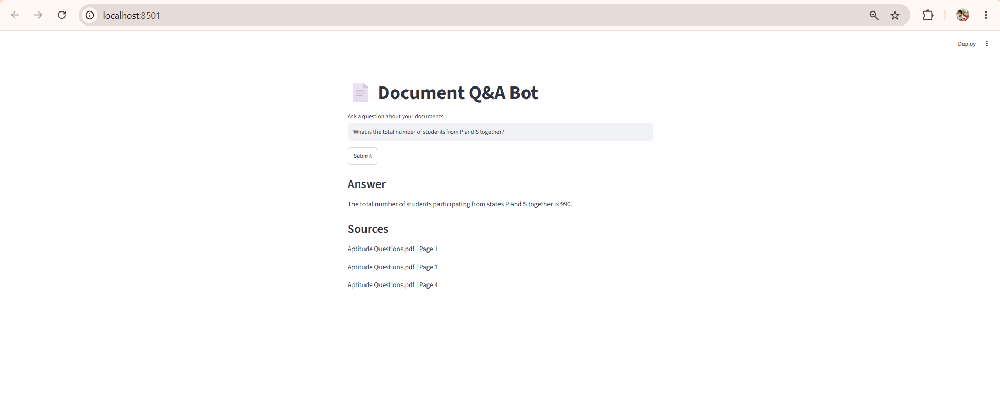
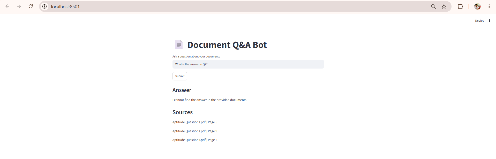
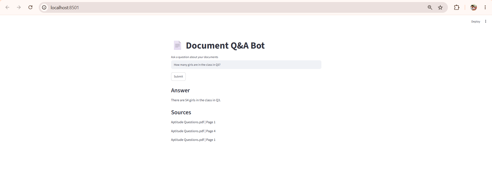

# 📄 Document Q&A Bot

A Retrieval-Augmented Generation (RAG) application that allows users to ask questions from PDF documents and receive context-aware answers using Google Gemini and ChromaDB.

---

## 🚀 Live Demo

Streamlit App:

https://document-app-bot-cg55evnxatuax4hjbdjr8a.streamlit.app/

---

## 📌 Features

- Upload and process PDF documents
- Extract text from PDFs
- Split text into manageable chunks
- Store document embeddings in ChromaDB
- Semantic search and retrieval
- Question answering using Google Gemini
- Display source documents and page numbers
- Streamlit-based interactive UI

---

## 🛠️ Tech Stack

- Python
- Streamlit
- Google Gemini API
- ChromaDB
- PyPDF
- python-dotenv

---

## 📂 Project Structure

```text
document-qa-bot/
│
├── data/
│   └── Aptitude Questions.pdf
│
├── db/
│   └── ChromaDB files
│
├── screenshots/
│   ├── a.png
│   ├── b.png
│   └── c.png
│
├── src/
│   ├── config.py
│   ├── ingest.py
│   ├── ingest_to_db.py
│   ├── main.py
│   ├── query.py
│   └── vector_store.py
│
├── requirements.txt
├── .gitignore
└── README.md
```

---

## ⚙️ Installation

### 1. Clone Repository

```bash
git clone https://github.com/varshithchinnu02-arch/document-qa-bot.git

cd document-qa-bot
```

### 2. Create Virtual Environment

```bash
python -m venv venv
```

### 3. Activate Virtual Environment

Windows:

```bash
venv\Scripts\activate
```

Mac/Linux:

```bash
source venv/bin/activate
```

### 4. Install Dependencies

```bash
pip install -r requirements.txt
```

---

## 🔑 Environment Variables

Create a `.env` file in the project root:

```env
GEMINI_API_KEY=your_gemini_api_key
```

Get your API key from Google AI Studio:

https://aistudio.google.com/

---

## ▶️ Running the Application

Start the Streamlit app:

```bash
streamlit run src/main.py
```

The application will open in your browser automatically.

---

## 🧠 How It Works

1. PDF documents are loaded and parsed.
2. Text is split into smaller chunks.
3. Chunks are converted into embeddings.
4. Embeddings are stored in ChromaDB.
5. User submits a question.
6. Relevant chunks are retrieved using semantic search.
7. Gemini generates an answer based on retrieved context.
8. Sources and page numbers are displayed.

---

## 📸 Screenshots

### Home Page



### Question Answering



### Generated Answer



---

## 🧪 Sample Question

**Question**

```
What is the total number of students participating from states P and S together?
```

**Answer**

```
990
```

---

## 🌐 Deployment

The application is deployed on Streamlit Cloud.

Live URL:

https://document-app-bot-cg55evnxatuax4hjbdjr8a.streamlit.app/

---

## 👨‍💻 Author

**Varshith Chinnu**

GitHub:

https://github.com/varshithchinnu02-arch

---

## 📜 License

This project is developed for educational and learning purposes.